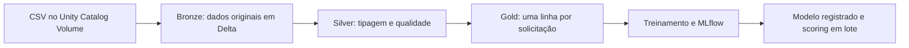

# Credit Risk Lakehouse — Home Credit

Laboratório exploratório de engenharia de dados e MLOps no Databricks, usando o dataset [Home Credit Default Risk](https://www.kaggle.com/competitions/home-credit-default-risk/data).

**Pergunta central:** como combinar dados da solicitação atual e do histórico de crédito para estimar o risco de inadimplência de uma forma calibrada e explicável?

## Escopo

O recorte inicial usa três arquivos:

| Fonte | Conteúdo | Chave |
| --- | --- | --- |
| `application_train.csv` | Solicitações atuais e variável-alvo `TARGET` | `SK_ID_CURR` |
| `bureau.csv` | Créditos anteriores informados ao bureau | `SK_ID_BUREAU`, associado a `SK_ID_CURR` |
| `previous_application.csv` | Solicitações anteriores na Home Credit | `SK_ID_PREV`, associado a `SK_ID_CURR` |

Os arquivos devem ser obtidos diretamente na página da competição, após aceitar suas regras. Os dados completos não serão versionados neste repositório.

Este projeto não pretende reproduzir toda a competição nem produzir uma decisão real de concessão de crédito.

## Arquitetura prevista



- **Bronze:** ingestão rastreável dos três arquivos.
- **Silver:** tipagem, tratamento de valores sentinela e validações de qualidade.
- **Gold:** agregação dos históricos por `SK_ID_CURR` e construção da tabela de atributos.
- **Modelagem:** regressão logística como baseline e um modelo de árvores como concorrente.
- **MLOps:** experimentos no MLflow, avaliação de calibração, registro do modelo e scoring em lote.
- **Análise:** consultas e dashboard de qualidade dos dados, distribuição de risco e desempenho do modelo.

## Avaliação planejada

ROC-AUC, PR-AUC, Brier Score, curva de calibração, desempenho por decil e métricas para limites de decisão definidos. O teste final ficará separado das decisões de seleção e calibração. A ausência de um backtest temporal confiável será documentada como limitação.

## Estrutura prevista

```text
config/              Configurações e manifesto das fontes
docs/                Decisões de arquitetura e modelagem
notebooks/           Etapas executadas na Databricks
src/credit_risk_lakehouse/
                     Código Python reutilizável
sql/                 Consultas de qualidade e dashboard
tests/               Testes das regras implementadas
```

## Ambiente local

Requisitos: Python 3.11 e [uv](https://docs.astral.sh/uv/). O ambiente local servirá para editar o código e executar verificações. O processamento principal com Spark e Delta ocorrerá na Databricks.

```bash
uv sync
uv run python -c "import credit_risk_lakehouse; print('Ambiente pronto')"
uv run ruff check .
```

As dependências de modelagem serão instaladas quando essa etapa começar. Não é necessário instalar Spark localmente para iniciar o laboratório.

## Estado do projeto

**Fundação em preparação.** Ainda não há pipelines, modelos treinados ou resultados publicados.

Próximo marco: examinar os três arquivos, confirmar schemas e cardinalidade das chaves e registrar os valores sentinela antes de implementar a ingestão Bronze.
