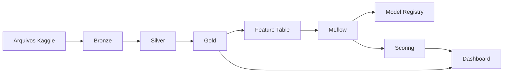

# Credit Risk Lakehouse - Home Credit

## 1. Visão geral

Laboratório exploratório end-to-end para consolidar conhecimentos de Data Engineering, Machine Learning e MLOps na Databricks. O projeto utilizará dados anonimizados do desafio [Home Credit Default Risk](https://www.kaggle.com/competitions/home-credit-default-risk/data) para construir um Lakehouse de risco de crédito.

**Pergunta principal:** como consolidar dados de solicitação e histórico de crédito para estimar, de forma calibrada e explicável, o risco de inadimplência de uma nova solicitação?

**Recorte inicial:**

- `application_train.csv`: solicitação atual e variável-alvo;
- `bureau.csv`: créditos anteriores reportados por outras instituições;
- `previous_application.csv`: solicitações anteriores registradas pela Home Credit.

**Entregas:** pipeline medalhão, tabela analítica por solicitação, modelos de risco, experimentos no MLflow, modelo registrado, tabela de scores, dashboard e documentação pública.

**Fora do escopo:** reprodução completa da competição, decisão real de concessão, cálculo de perda esperada e uso de todos os arquivos disponíveis.

## 2. Arquitetura prevista



### Bronze

- Ingestão dos três arquivos sem alterações destrutivas.
- Persistência em Delta com schema inicial e metadados de ingestão.
- Campos técnicos: `_source_file`, `_ingested_at`, `_ingestion_batch_id` e `_record_hash`.
- Controles de contagem, schema e duplicidade técnica.

### Silver

- Tabelas: `application`, `bureau_credit` e `previous_application`.
- Tipagem explícita, normalização de nomes e categorias e tratamento de valores sentinela.
- Validação de chaves, nulos, domínios, valores financeiros e registros órfãos.
- Deduplicação e documentação das regras de qualidade.

### Gold

- `credit_risk_features`: uma linha por `SK_ID_CURR`.
- Agregações de quantidade, valor, saldo, atraso, status, recência e histórico de propostas.
- Razões financeiras derivadas, como crédito/renda e anuidade/renda.
- `credit_risk_predictions`: probabilidade, faixa de risco, versão do modelo, data do scoring e explicações.

## 3. Modelagem e MLOps

### Modelos

1. Regressão logística como baseline interpretável.
2. Gradient-boosted trees ou XGBoost como modelo não linear.

### Avaliação

- ROC-AUC e PR-AUC;
- Gini e KS;
- Brier Score e curva de calibração;
- matriz de confusão por threshold;
- recall de inadimplentes por volume analisado;
- bad rate por decil de score.

### Validação

- Separação estratificada em treino, validação e teste a partir de `application_train`.
- Cross-validation apenas no treino.
- Calibração definida sem acesso ao teste final.
- Auditoria de leakage entre solicitação atual e históricos agregados.
- Análise de desempenho e possíveis vieses por segmentos relevantes.
- Registro explícito da ausência de backtest temporal como limitação do dataset.

### MLflow e governança

- Registrar parâmetros, métricas, features, versão dos dados e artefatos.
- Comparar modelos por discriminação, calibração, interpretabilidade e custo operacional.
- Registrar o modelo selecionado no Model Registry do Unity Catalog.
- Associar cada execução de scoring à versão do modelo e dos dados.

## 4. Dashboards finais

1. **Visão da carteira:** solicitações, inadimplência observada, valores de crédito e distribuição dos scores.
2. **Segmentação de risco:** decis de score, bad rate, faixas de renda/crédito e perfis de maior risco.
3. **Desempenho do modelo:** ROC/PR, calibração, thresholds e matriz de confusão.
4. **Qualidade de dados:** nulos, duplicidades, registros órfãos, falhas de domínio e volumes por camada.

## 5. Recursos Databricks e stack

- Databricks Free Edition;
- Apache Spark e PySpark;
- Spark SQL;
- Delta Lake;
- Unity Catalog e Volumes;
- arquitetura Bronze/Silver/Gold;
- Lakeflow Jobs;
- Lakeflow Declarative Pipelines, se disponível;
- MLflow Tracking;
- Model Registry;
- Databricks SQL e dashboards;
- Python, SQL, Pandas e Scikit-learn/XGBoost;
- Git e GitHub;
- testes com Pytest e validações em PySpark.

## 6. Estrutura sugerida do repositório

```text
credit-risk-lakehouse/
├── README.md
├── pyproject.toml
├── config/
│   ├── datasets.yml
│   └── project.yml
├── docs/
│   ├── architecture.md
│   ├── data_dictionary.md
│   ├── modeling.md
│   └── images/
├── notebooks/
│   ├── 01_ingest_bronze.py
│   ├── 02_transform_silver.py
│   ├── 03_build_gold.py
│   ├── 04_train_models.py
│   ├── 05_evaluate_register.py
│   └── 06_batch_scoring.py
├── src/credit_risk/
│   ├── ingestion/
│   ├── transformations/
│   ├── features/
│   ├── quality/
│   └── modeling/
├── sql/
│   ├── quality_checks.sql
│   └── dashboard_queries.sql
├── tests/
└── sample_data/
```

Os arquivos completos do Kaggle não serão versionados. O repositório manterá instruções de obtenção, manifesto das fontes e apenas amostras permitidas para testes.

## 7. Cronograma end-to-end

| Fase | Duração | Entregas técnicas | Publicação sugerida |
|---|---:|---|---|
| 1. Fundação | Semana 1 | Repositório, ambiente, catálogo, volumes, amostra e desenho da arquitetura | Apresentação do problema e arquitetura |
| 2. Bronze | Semana 2 | Ingestão dos três arquivos, Delta e metadados técnicos | Ingestão rastreável e Delta Lake |
| 3. Silver | Semana 3 | Limpeza, schemas, chaves e qualidade de dados | Decisões de qualidade e valores sentinela |
| 4. Gold | Semana 4 | Agregações relacionais e feature table por solicitação | Arquitetura medalhão e engenharia de atributos |
| 5. Baseline | Semana 5 | Regressão logística, split e tracking no MLflow | Baseline, métricas e prevenção de leakage |
| 6. Modelo concorrente | Semana 6 | Modelo de árvores, calibração e análise por segmentos | Por que ROC-AUC não basta em risco de crédito |
| 7. Operacionalização | Semana 7 | Model Registry, batch scoring, tabela de previsões e Lakeflow Job | Versionamento e ciclo de vida do modelo |
| 8. Entrega | Semana 8 | Dashboards, README, documentação, testes e demonstração | Case final com resultados, limitações e repositório |

## 8. Critérios de conclusão

- Pipeline reproduzível de Bronze a Gold.
- Execuções idempotentes e validações documentadas.
- Feature table sem duplicidade por solicitação.
- Dois modelos comparados com experimentos rastreados.
- Probabilidades avaliadas e calibradas.
- Modelo registrado e scoring em lote executável.
- Dashboard com risco, modelo e qualidade de dados.
- README com arquitetura, resultados, limitações e instruções de reprodução.
